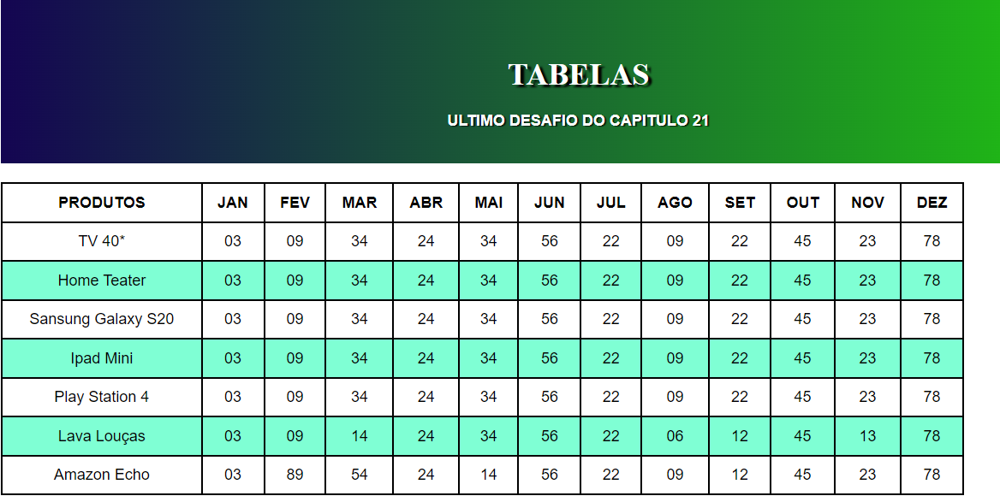

# TABELA RESPONSIVA
👨‍🏫PROJETO FEITO PARA O CURSO DE HTML E CSS DO CURSO EM VIDEO.

 <br>

## DESCRIÇÃO:
A página HTML cria uma tabela responsiva que exibe dados de vendas de produtos ao longo de um ano. Aqui está uma descrição do que o aplicativo faz, seus recursos e como usá-lo:

1. **Cabeçalho Atraente:**
   - O cabeçalho apresenta um título e uma breve descrição do propósito da tabela.

2. **Tabela de Dados:**
   - A tabela exibe dados de vendas de produtos ao longo de um ano, divididos por meses.

3. **Produtos e Vendas:**
   - Cada linha da tabela representa um produto diferente.
   - As colunas representam os meses do ano, com os valores correspondentes representando as vendas de cada produto em cada mês.

4. **Estilo Visual:**
   - O estilo visual da tabela é limpo e profissional, com bordas e cores bem definidas para facilitar a leitura e compreensão dos dados.

5. **Responsividade:**
   - A tabela é responsiva, o que significa que pode ser visualizada em dispositivos de diferentes tamanhos de tela sem comprometer a legibilidade dos dados.

## COMO USAR?
### BAIXANDO O PROJETO:
* Clone o repositório para o seu sistema local:

```bash
git clone https://github.com/VILHALVA/TABELA-RESPONSIVA.git
```

* Navegue até o diretório do projeto.

```bash
cd TABELA-RESPONSIVA
```

* Descompacte o arquivo ZIP (se você baixou manualmente):

```bash
unzip TABELA-RESPONSIVA.zip
```

### EXECUTANDO O PROJETO:
1. **Visualização Inicial:**
   - Ao abrir a página HTML (`CODIGO.html`) no navegador, você verá a tabela completa exibindo os dados de vendas de produtos ao longo do ano.

2. **Rolagem Horizontal:**
   - Se a largura da tela for insuficiente para exibir toda a tabela, você pode rolar horizontalmente para visualizar as colunas restantes.

3. **Explorar Dados:**
   - Explore os dados da tabela para entender as vendas de cada produto ao longo dos meses.

4. **Estilo Personalizado:**
   - Se desejar, você pode personalizar o estilo da tabela editando o arquivo CSS fornecido.

5. **Adaptação a Dispositivos Móveis:**
   - A tabela se adapta automaticamente a diferentes tamanhos de tela, permitindo uma experiência de visualização ideal em dispositivos móveis e desktops.

## NÃO SABE?
- Entendemos que para manipular arquivos em `HTML`, `CSS` e outras linguagens relacionadas, é necessário possuir conhecimento nessas áreas. Para auxiliar nesse aprendizado, oferecemos cursos gratuitos disponíveis:
* [Curso de HTML e CSS](https://github.com/VILHALVA/CURSO-DE-HTML-E-CSS)
* [Curso de JavaScript](https://github.com/VILHALVA/CURSO-DE-JAVASCRIPT)
* [Confira mais cursos](https://github.com/VILHALVA?tab=repositories&q=+topic:CURSO)

## CREDITOS:
- [PROJETO FEITO PELO VILHALVA](https://github.com/VILHALVA)
- [PROJETO FEITO PARA O CURSO DE HTML E CSS](https://github.com/VILHALVA/CURSO-DE-HTML-E-CSS)
- [ESTÁ DISPONIVEL NO SITE](https://vilhalva.github.io/STYLER/STYLER.html)
